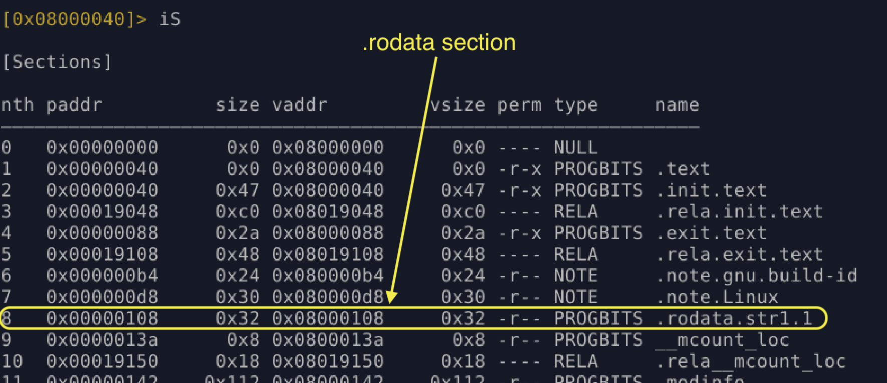
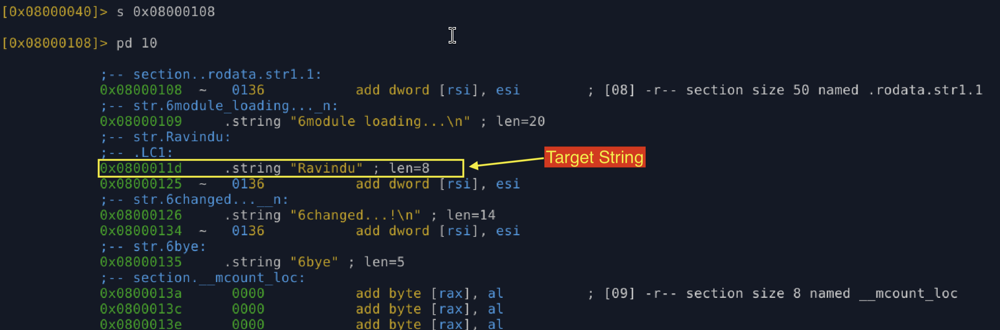
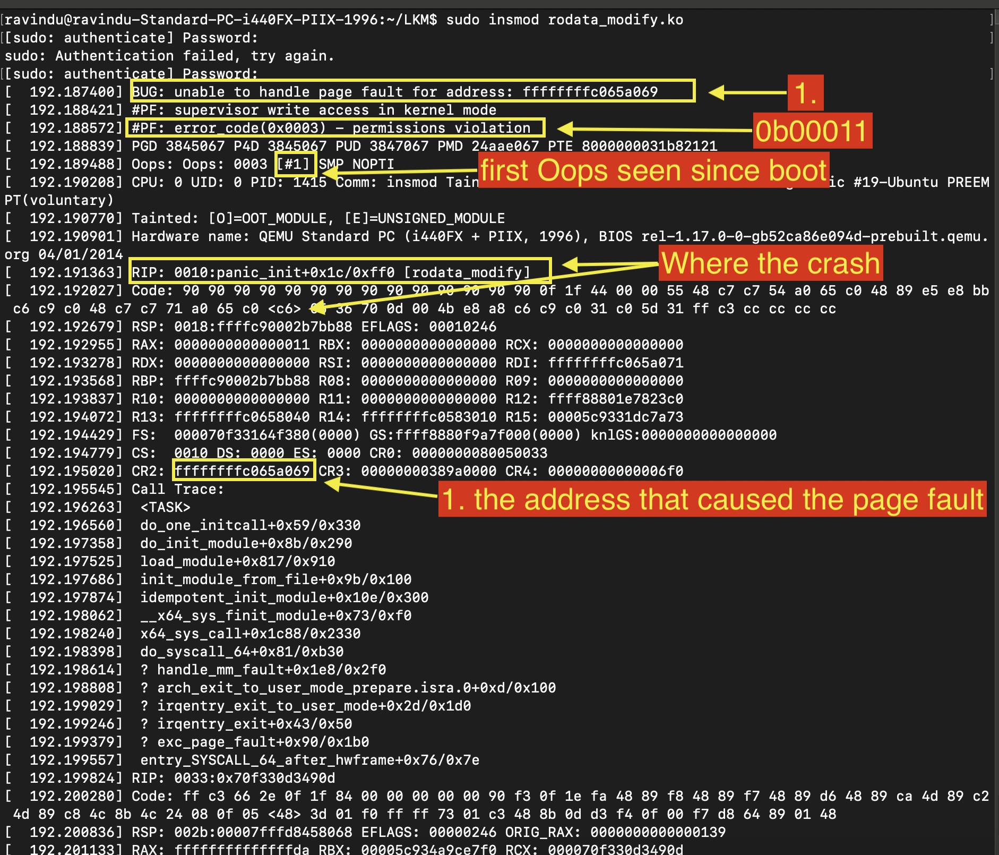
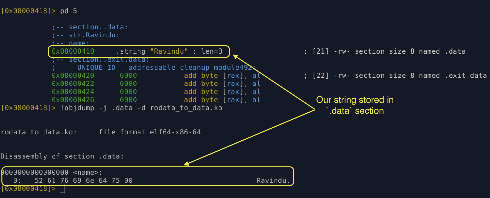
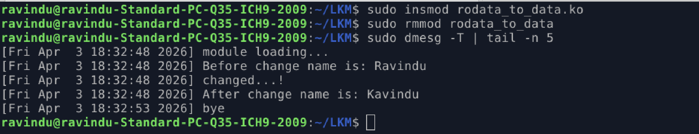

# Try to write .rodata(read only data)

- sources
    - modules/unsafe/rodata_modify.c

## Goal

- Try to write the .rodata and observe the kernel behaviour.

## Steps

### Check the `.rodata` for confirmation that our data is stored on `.rodata`, not the `.data` section.

1. find the virtual address of the .rodata section



2. extract the strings.



### Load the module and Observe the behaviour

1. Load the module and observe the behaviour

- for loading:
    - sudo insmod rodata_modify.ko

### Crash details




### **Interpret the bits (x86_64 Page Fault)**

| Bit      | Name              | Value | Meaning                                                 |
| -------- | ----------------- | ----- | ------------------------------------------------------- |
| 0 (P)    | Present           | 1     | Page **present**, so this is a **protection violation** |
| 1 (W/R)  | Write/Read        | 1     | **Write access** caused the fault                       |
| 2 (U/S)  | User/Supervisor   | 0     | **Kernel mode** (supervisor)                            |
| 3 (RSVD) | Reserved bit      | 0     | No reserved bit violation                               |
| 4 (I/D)  | Instruction fetch | 0     | Not an instruction fetch   

### General fix

change .rodata -> .data like this

```c
static char name[] = "Ravindu";
name[0] = 'K';
```

- source location:
    - modules/rodata_to_data.c


### Veryfy the string store place



### Program output

